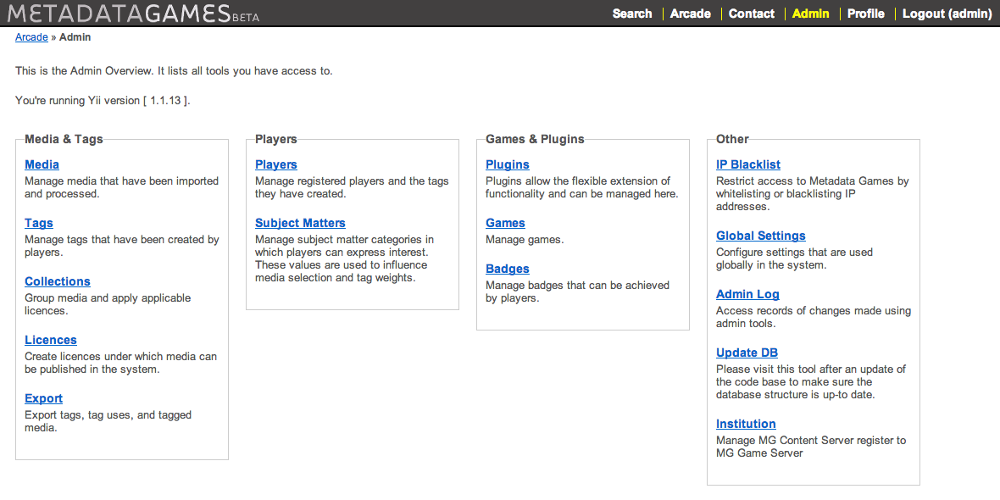
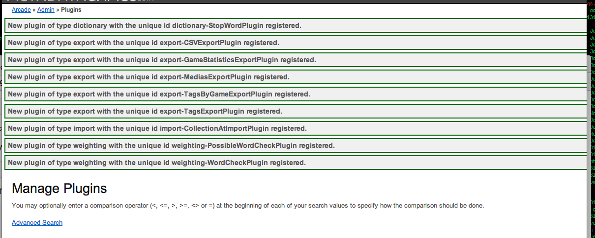
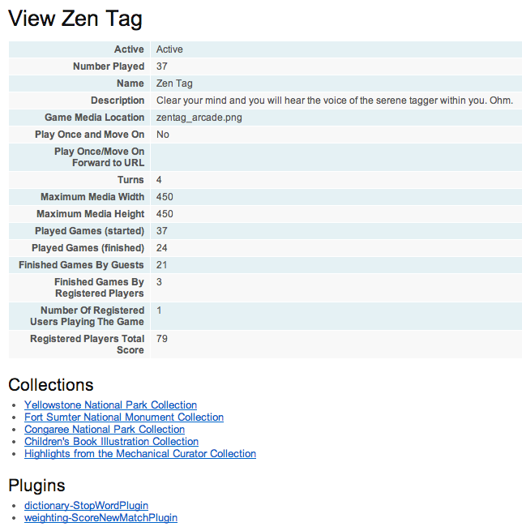

# Game App Configuration #

Once the MG Game App and a Content App are installed, it's time to configure your system:

1. Login to gain access to the admin tool.
2. Visit the plugin tool.
3. Visit the games tool and activate the ones you want to use.
4. Activate Institutions' Content Apps
5. Go to the Arcade and play!


## 1. Login ##

Gain access to the Game App by signing in with your newly-created account at the login screen.

```
http://GAME_APP_URL/www/index.php/user/login
```


You can access the "Admin Overview" page by clicking on "Admin" in the Metadata Games navigation bar at the top of the page. This page contains links to all of the available tools. These links also appear in the Admin navigation bar, underneath the Metadata Games navigation bar.



> __NOTE:__ For detailed information about all admin tools, see the [Site Administration](adminGuide_gameapp.md) guide in the Metadata Games documentation/ folder.


## 2. Visit the Plugin Tool ##

From the Admin Overview, click __Plugins__ to register and configure plugins settings.

For more information on plugins options, see the [Plugin Default Settings](mg_guide_plugindefaultsettings.html "Plugin Default Settings") help guide in the Metadata Games documentation/ folder.




## 3.Activate & Configure Games ##

Use the "Games" tool to activate and customize the games you want to use.

* Select game to update by clicking on update icon
* Change status to __Active__
* Check all of the collections to use in game
* Select plugin(s) to use with game (see below for list of plugins to use for each game)
* Leave other settings as they are.

### Default plugins to use ###
* Zen Tag - dictionary-StopWordPlugin, weighting-ScoreNewMatchPlugin
* Nextag - dictionary-StopWordPlugin, weighting-ScoreNewMatchPlugin
* Guess What! - dictionary-StopWordPlugin, weighting-GuessWhatScoringPlugin
* One Up - dictionary-StopWordPlugin
* Pyramid Tag - dictionary-StopWordPlugin




For information about specific games and settings, view the [Game Default Settings](mg_guide_gamedefaultsettings.html "Game Default Settings") help guide in the Metadata Games docuementation/ folder.


## 4. Activate Institutions' Content Apps ##

From the Admin Overview, click __Institutions__, click the Update icon for an institution, change the status to __Active__ and save; Institutional media is now available to use in the games.

**Your system setup is complete. Go to the Arcade and play!**

