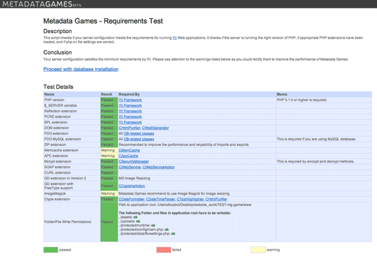
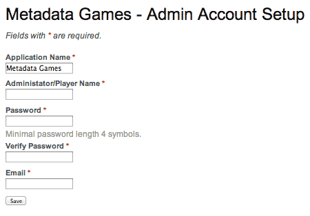
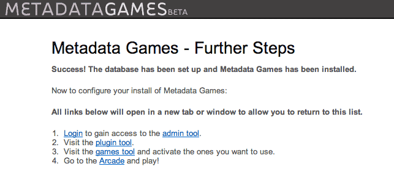

# Installation #

- [Requirements](#requirements)
- [Grab Game App source code](#grab-game-app-source-code)
- [Install NodeJS](#install-nodejs) (Skip if not using One Up game)
- [Install flask and mod_wgsi](#install-flask-and-mod_wgsi) (for NLP framework)
- [Install Game App](#install-game-app)
- [Running Game App over https](#running-game-app-over-https)


## Requirements ##

###LAMP Stack (linux, apache, mysql, php) ###

We are currently using the following:
* Ubuntu 13.10
* Apache 2.4.6
* PHP 5.5.3
* MySQL 5.5.34


### Other things to install ###
* NodeJS (push notifications for One Up game; currently using 0.10.22)
  * Open port at 8000 (or other higher numbered one)

* For nlpserver
  * Python 2.7.4+
  * Flask (python server) + apache mod_wgsi (for NLP framework)
    * Open port at 8139

* SSL cert (if you decide to use https://)

* Make sure that sendmail is on; this is used for sending registration activation emails to players.


### Check PHP Memory Limit ###
Before installation, have a system administrator configure your server's php.ini file to make sure its PHP memory limit is at least 128 MB. We currently recommend 300 MB or more if you are looking to import and use more than 10,000 images or are importing audio and/or video media.

* Modify php.ini file
  * On Ubuntu, you can find this in /etc/php5/apache2/
  * memory_limit - change from 128M to 300M or higher to large image sets, and audio/video media
  * post_max_size - change from 8M to 220M to accommodate larger media
  * upload_max_filesize - change from 2M to 256M to handle audio and video file uploads

* If running PHP 5.5+
  * Must define date.timezone (e.g., date.timezone # "America/New_York")
  * Make sure you also change this in php.ini in /etc/php5/cli/
  * Reload apache


## Grab Game App Source Code ##

[Download the Game App source code](../README.md#grabbing-the-game-app-code)

## Install NodeJS ##

We use NodeJS for push notifications in One Up game.
Safest way to install is to app from source.

### Build From Source ###
We are currently using v0.10.22

Become root and make a software directory
```
mkdir -p ~/software/nodejs
```

cd into that directory.
```
cd ~/software/nodejs
```

Grabbing tarball
```
wget http://nodejs.org/dist/v0.10.22/node-v0.10.22.tar.gz
```

Unpack it:
```
tar -zxvf XXXXX.tar.gz
```

cd into the directory, and read the README.md. That file indicates a
standard config/make/make install process.

We'll need gcc installed first. On Ubuntu, this is easy:
```
apt-get install app-essential
```

Then build and install:

```
./configure
make
make install
```

Most content installs here:
```
/usr/local/lib/node_modules/{npm}
```

### Configure NodeJS ###

#### Open port to 8000 ####
* Make sure port 8000 is open (or whatever port you will use for NodeJS)


#### Install required packages in package.json ###
* In mg-game/nodejs/ folder
* Install packages from nodejs/package.json
```
npm install
```
* You should now see the folder node_modules/ in nodejs/ folder


#### Modify settings.js ####
* __modify mgapi URL__
mgapi : 'http://GAME_APP_LOCATION/www/index.php/api/

* Test URL by entering into web browser window.
  * __WORKS__ - you see text that starts with "MG API"
[ Link to image metadatagames_gameApp_mg-api_correct.png ]


### start nodejs ###
nohup node server.js > nodejs_output.log &
* This runs node server in background and keeps a log file
  * Make sure to rename .log if restarting nodejs for troubleshooting
* Could also more gracefully handle crashes using Forever
  * https://github.com/nodejitsu/forever
  * As of this writing, Forever was missing dependencies to run nodejs 0.10.22
* After starting node server, look in nodejs_output.log
  * If working, you should see "info: socket.io started"


## Install flask and mod_wgsi ##

* Flask and mod_wgsi are used to set up NLP prototype framework
* See README in nlp/ folder for more info
* Make sure port 8139 is open (or whatever port you use for flask)
* Below is a step-by-step way to install on Ubuntu server

__Install pip__
```
sudo apt-get install python-pip
```


__Install virtualenv__
This is used to create virtual python environments
to handle possible dependencies conflicts in the future
```
sudo apt-get install python-virtualenv
```

Create virtual python environment
* Open project folder in question, then type
```
virtualenv [name of virtual python environment]
```
* For example,
```
virtualenv venv
```

* Now activate python virtual environment
```
. venv/bin/activate
```


__Install Flask__

```
pip install flask
```

You'll need pyenchant for parts of the NLP programs to work
```
pip install pyenchant
```

Start flask server
* (from nlp folder)
```
python run_nlpserver.py
```

Test flask server
```
curl http://localhost:8139/possible_wordcheck?input=cromulent
```

* You should get a response that looks something like this:

```
--------------------------------------------------------------------------------
DEBUG in possible_wordcheck [/mg-game/nlp/nlpserver/scripts/possible_wordcheck/possible_wordcheck.py:81]:
cromulent 0.00372197658456
--------------------------------------------------------------------------------
--------------------------------------------------------------------------------
INFO in possible_wordcheck [/mg-game/nlp/nlpserver/scripts/possible_wordcheck/possible_wordcheck.py:89]:
cromulent could be a word.
--------------------------------------------------------------------------------
127.0.0.1 - - [24/Dec/2013 13:56:35] "GET /possible_wordcheck?input#cromulent HTTP/1.1" 200 -
```

### If using flask with mod_wsgi ###

Stop flask server
```
ps ux
kill -9 PID_NUMBER
```

Deactivate flask if going to install with mod_wsgi
```
deactivate
```
(deactivates venv)

#### Install mod_wsgi ####
When using mod_wsgi with flask, it is not necessary to start a flask server.
```
sudo apt-get install libapache2-mod-wsgi
```

Copy nlpserver file in nlp/examples/ to /etc/apache2/sites-available folder.
* If on Ubuntu 13.10 which runs Apache 2.4.6+, add .conf extension to filename.


Also make sure apache is listening to port 8139 and that it is open in firewall.

Modify nlpserver file to reflect current settings (user, location of files).

Also modify apache2.conf to include path to python virtual environment.
For example,
```
WSGIPythonHome GAME_APP_LOCATION/nlp/venv
```

Enable nlpserver.conf and restart apache.
```
a2ensite nlpserver.conf
service apache2 reload
```

TEST: go to http://GAME_APP_URL:8139
* you should see the text, "NLP API: Swagatam"

TEST2: from commandline, test nlp is working.
```
curl http://localhost:8139/possible_wordcheck?input=cromulent
```

* If working, you should see something like the following output:
```
{
  "response": true
}
```


## Install Game App ##

In www/protected/data folder, copy fbvsettings_default.php and save it as fbvsettings.php.

In fbvsettings.php, edit the following lines to reflect your current setup:

```
  'nodeJSUrl' => 'http://localhost:8000', /* change URL */
  'pushUrl' => 'http://localhost:8000/message/', /* change URL */
  'nlpApiUrl' => 'https://localhost:8139', /* change URL */
```

If you use Facebook for login, make sure you also edit the following in fbvsettings.php:

```
  'facebookId' => 'GET FROM YOUR FACEBOOK DEVELOPER ACCOUNT',
  'facebookSecret' => 'GET FROM YOUR FACEBOOK DEVELOPER ACCOUNT',
```

In mg-game folder, go to tools and run fix-perms script.

```
cd tools
./fix-perms.sh
```

>__fix-perms.sh changes group ownership to www-data, which in Ubuntu systems allow the web server access__

The following folders and files need www-data group ownership:
```
assets/
uploads/
protected/runtime/
protected/config/main.php
protected/data/fbvsettings.php
```

Go to web browser and open URL that you have pointed towards your Game App.
```
http://GAME_App_LOCATION/www/
```

Click "Proceed with system requirement test" to run a test of server capabilities. This will ensure that your server can support the required Yii framework.

> __NOTE:__ Particular directories and files will need to be writable
> by the webserver user. On Debian/Ubuntu systems, this user is
> usually 'www-data' while RedHat and derivatives often use
> 'apache'. The _fix-perms.sh_ script located in the tools/ directory
> may be of help. Please read the code carefully before use!



If your server passes the system requirement test, you may then click __"Proceed with database installation"__, bring you to the Database Setup page.


### Database Setup ###

You will need to fill out the __Database Name, Database User Name, and Database Host Name__ fields for the database you wish to use. If the database has a password, enter this in the Database Password field as well. If you do not have this information, please contact your system administrator. Leave the Database Host Port field blank. If you have not already created a database for use with Metadata Games, please do so now.

After entering the required information, click "Submit".


### Admin Account Setup ###

At the "Admin Account Setup" page, fill out the following fields:

  * __Application Name__ - The name for your install of Metadata Games.

  * __Administrator/User Name__ - The name of the administrator's account.

  * __Password__ - A password for the administrator's account.

  * __Verify Password__ - Enter the same password, for confirmation.

  * __Email__ - A valid email address for the administrator.



Then click "Save". Congratulations! You have successfully installed the Game App for Metadata Games! Now to __[install the Content App](https://github.com/tiltfactor/mg-content/tree/development/documentation/install_contentapp.md)__ and then __[configure the games](configure_gameapp.md)!__




## Running Game App over https ##
If running over https, the following files need to be modified
* nodejs/server.js
* nodejs/settings.js
* www/protected/data/fbvsettings.php
* mg.game.oneup.main.js in /protected/modules/games/assets/oneup/js/


### nodejs/server.js ###
* uncomment section to run nodejs over https
* add key.pem and cert.pem
  * More info on creating .pem files: http://www.digicert.com/ssl-support/pem-ssl-creation.htm
  * Make sure access to these files are read-only by owner (eg, 400)


### nodejs/settings.js ###
* Make sure mgapi URL is __https://__

### fbvsettings.php ###
* Make sure nodeJSUrl and pushUrl are __https://__

### mg.game.oneup.main.js ###
* Uncomment line with 'io.connect' so that :secure option is enabled.


